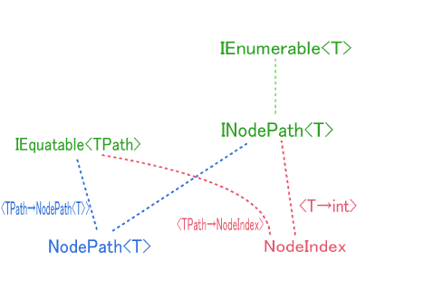

# Introduction
ツリー構造を効果的に扱うためのC#ライブラリです。  
このライブラリは柔軟性と拡張性を重視し、さまざまなツリー構造を容易に操作できるように設計されています。

特徴は
1. `ITreeNode<TNode>` に対する豊富な拡張メソッド
1. 親ノードと子ノードの相互参照を実現
1. ツリー構造をなすクラス群とそれらの拡張性
1. 異なるデータ構造とツリー構造の相互変換

以上4つが挙げられます。

## 名前空間とその分類

### TreeStructures;  
　abstractで定義された汎用ツリーノード、周辺オブジェクト、イベント引数
 
 汎用ツリーノードの継承図
 
 

 NodePathとNodeIndex (周辺オブジェクト) の継承図
 

### TreeStructures.Linq;
　`ITreeNode<TNode>`, `IMutableTreeNode<TNode>`, `IEnumerable<T>`に対する拡張メソッド
### TreeStructures.Utility;
　Try○○メソッドの戻り値として使用する`ResultWithValue<T>`の定義など
### TreeStructures.Collections;
　内部実装や拡張メソッドの処理過程などで使用されるコレクション　
### TreeStructures.EventManagement;
　Event関連、ObservableなTreeNodeを実装するときに使用するオブジェクトなど
### TreeStructures.Xml.Serialization;
　シリアライズ・デシリアライズ時に使用するDictionaryなど
### TreeStrucutures.Tree;
　目的・用途を特定したツリー

## Useage
[wiki](https://github.com/Houzkin/TreeStructures/wiki/Home_ja) に書く

## Concept
このライブラリで完結することは目指していません。  
既に様々な便利なライブラリが公開されているので、ツリー構造に関する機能を担いつつ、他ライブラリとの共存を目指しています。  
  
冒頭にて示した4つの特徴について補足します。
### 豊富な拡張メソッド
`ITreeNode<TNode>`の拡張メソッドはオーバーロードも含め60以上を定義しています。  
例を挙げると、  
列挙は`Preorder`, `Levelorder`など全ての走査法や、 `Leafs`, `Ancestors`, `DiscendArrivals`, `DescendTraces`, etc  
移動は、`Root`, `NextSibling`, `LastSibling`, etc  
編集は`TryAddChild`をはじめ、`Try○○Child`, `Disassemble`, `RemoveAllDescendant`, etc  
パラメータの取得は、`NodeIndex`, `NodePath`, `Height`, `Depth`, etc  
判定メソッドは、`IsDescendantOf`, `IsAncestorOf`, `IsRoot`, etc  
変換は、`ToNodeMap`, `ToSerializableNodeMap`, `ToTreeDiagram`, `AsValuedTreeNode`  
組み立てメソッドは、`Convert`, `AssembleTree`, `AssembleAsNAryTree`  

### 親ノードと子ノードの相互参照
親ノードと子ノードの相互参照は基底クラス(TreeNodeBase or HierarchyWrapper)で処理されます。  
TreeNodeBaseの派生型では、RemoveChildProcess、InsertChildProcessなど、protected virtualで定義された○○ChildProcessメソッドでカスタマイズできます。

### ツリー構造をなすクラス群とその汎用性
細かくカスタマイズするならTreeNodeBase。  
GeneralTreeで、データ構造またはデータのコンテナとして使用するならGeneralTreeNodeまたはObservableTreeNode、  
Branchの数を固定して、空のノードをnullとするN-Ary Treeとして使用するのであればNAryTreeNode、  
階層構造をなすオブジェクトまたはツリー構造の、ラッパークラスとして使用するならば(Hierarchy | TreeNode) Wrapper、  
ラッパーとしての機能に加え、MVVMにおけるViewModelなど、観測可能且つインスタンスの破棄が必要な場合はBindable(Hierarchy | TreeNode) Wrapper  
をそれぞれ継承して使用してください。

TreeNodeBaseとその派生型ではSetup(Inner | Public)ChildCollectionメソッドをオーバーライドすることで、内部で扱うコレクションと外部に公開するコレクションをカスタマイズできます。  
HierarchyWrapperとその派生型は外部に公開するコレクションのみカスタマイズできます。  
  
### 異なるデータ構造とツリー構造の相互変換
`ITreeNode<TNode>`を実装していないオブジェクトへ`ITreeNode<TNode>`の拡張メソッドを提供と相互変換もサポートしています。  
`HierarchyWrapper<TSrc,TWrpr>`または`BindableHierarchyWrapper<TSrc,TWrpr>`で階層構造をなすオブジェクトをラップする、または、`AsValuedTreeNode`を呼び出して`ITreeNode<TNode>`の拡張メソッドを提供します。  
その他にも、拡張メソッドの`Convert`や`AssembleTree`、`ToNodeMap`など、相互変換方法をいくつか用意しています。  
